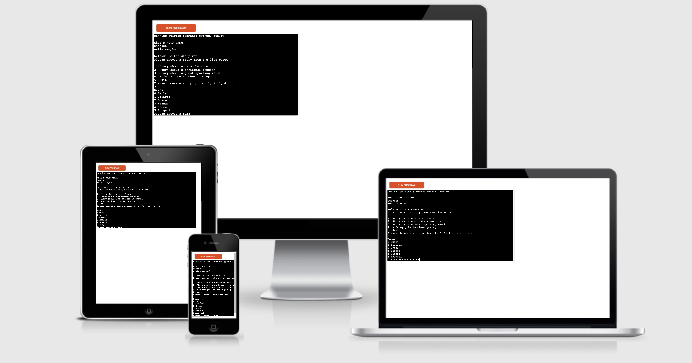
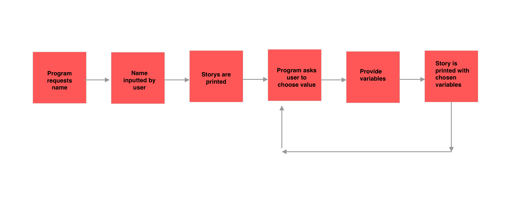

# Story Vault - A Selection of stories for your Enjoyment

View the live project [here](https://soconne339-story-vault.herokuapp.com/)

This image is from [Am I responsive](http://ami.responsivedesign.is/)

## Intro

This Story-Vault is a command-line based application which allows the user to choose from a selection of stories using the input keyboard. The app was created so the user can use a variety of different nouns and verbs to create a story. The story is extremely user friendly and is aimed at adults and children who are able to read (6 years +)

## UX

The program was created with simplicity in mind. the only thing the user has to do is input their name, numbers 1-4 and yes/no. This means that it 's user friendly to anyone who can read and type English. 

## Ideal Client

The ideal client for this program is: 
1. Someone who is English speaking with full literacy skills
2. Someone who likes to read 
3. Someone who enjoys an interactive experience
4. Someone young

## User Stories

1. 38F - I found the program quite interesting and I liked the selection of stories available. 
2. 9M - I would love to have an option to create a game by choosing the words. The jokes were funny
3. 60F - I loved using the program and it left a smile on my face. Nice and easy to use and the jokes were hillarious

## Skeleton

The program was outputted as a terminal therefore it's a single page application. Python was used to generate the data and stories. I have included a flow-chart to illustrate the program's process. 

## Scope

To achieve the goal of the project I included the following: 

1. A list of 3 stories and a selection of jokes
2. A personal greeting at the beginning
3. The user can choose another story after choosing variables for the current story
4. The option to end the program at any time.

## Main Design

The program features a variety of python functions that make up each story. Eg. for the Hero story, the Christmas Story and the Sporting Story. Also the jokes are containing within its own python function. There is a also a python function to ask for the user's name. To recall any of the functions, I created a main_function() The conditional ststement decides which function is called or in this case which story is chosen. 

To avoid having to repeat code, a dictionary function. This function takes 3 input; the name of the list, the title message and the input message. This function also checks for any index error and value error using a try and catch statement. 

Overall the program uses quite a simple design and the output text is clear and concise. There is no ambiguity for the user.

## Technologies Used

For this project I used the following software: 

- Github
- Sketch ( To create the flowchart)
- VSCode Desktop (to create the initial code)
- Python tutor
- Heroku (To show the python program as a web app)
- MacOSX on MacbookPro 13

## Deployment

This project was deployed as a web application using Heroku. The project was also pushed to GitHub by using GitPod and Git commands. 

To deploy this page to Heroku from GitHub, do the following:

1. Create an account on [Heroku](www.heroku.com)
2. Click ‘Create new App’ from the top menu
3. Choose a name for the app and then choose the region as Europe
4. In settings, add a build pack for Python and Node.js
5. Click on Config Vars and add ‘Port’ for key and ‘8000’ for value
6. Click save changes
7 . Click on the deploy tab and then click connect to GitHub
8. Search for repository name and then once this is done, click connect. 
7. Deploys can be done manually or automatically. For this project, click ‘automatic deploys’
9. After the project has been successfully deployed, click on ‘open app’ at the top of the page to open the newly created web app. 

## Testing

## Validation

## Credits
